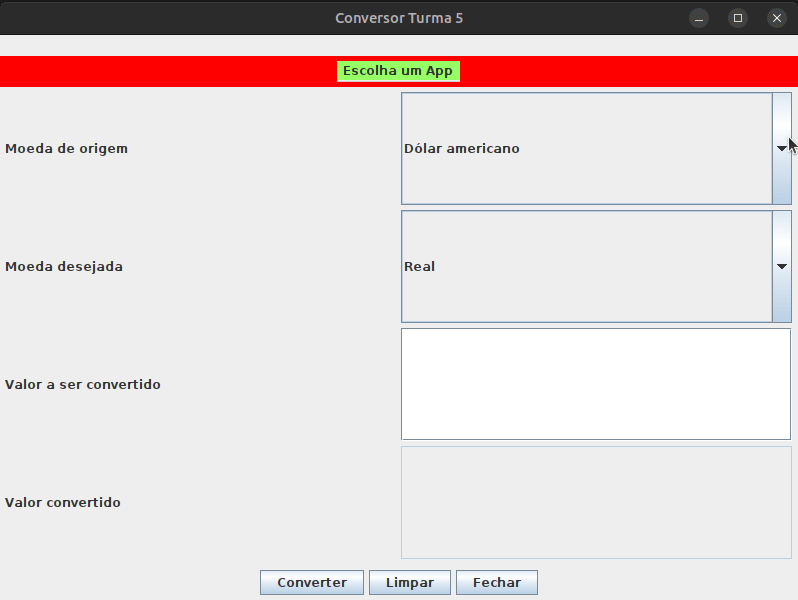

# Conversor de Moedas

Este repositório contém um simples aplicativo de Conversor de Moedas construído com o uso do Java Swing. O aplicativo permite aos usuários converterem moedas entre diferentes denominações usando uma API externa para obter as últimas taxas de câmbio.

## Funcionalidades

- Conversão de moedas entre várias denominações: Real (BRL), Dólar americano (USD), Euro (EUR), Libra Esterlina (GBP), Peso Argentino (ARS), Peso Chileno (CLP).
- Obtenção de taxas de câmbio em tempo real de uma API externa.
- Interface amigável com campos de entrada e saída claros.
- Layout responsivo para facilitar o uso.

## Como Executar

1. Clone o repositório para a sua máquina local.
2. Abra o projeto na sua IDE preferida, como Eclipse ou IntelliJ.
3. Compile e execute o arquivo `App.java` localizado no pacote `org.conversor`.
4. O aplicativo será aberto em uma janela, pronto para ser utilizado.

## Utilização

1. Selecione as moedas de origem e destino nos respectivos menus suspensos.
2. Digite o valor que deseja converter no campo "Valor a ser convertido".
3. Clique no botão "Converter" para obter o valor convertido exibido no campo "Valor convertido".
4. Se desejar limpar os campos de entrada e saída, clique no botão "Limpar".
5. Para fechar o Conversor de Moedas, clique no botão "Fechar" ou feche a janela do aplicativo.

## Observações

- O aplicativo utiliza a biblioteca OkHttp para fazer requisições HTTP à API de taxas de câmbio.
- As taxas de câmbio são obtidas da API [exchangerate.host](https://exchangerate.host).
- Certifique-se de ter conexão com a internet para que o aplicativo funcione corretamente.